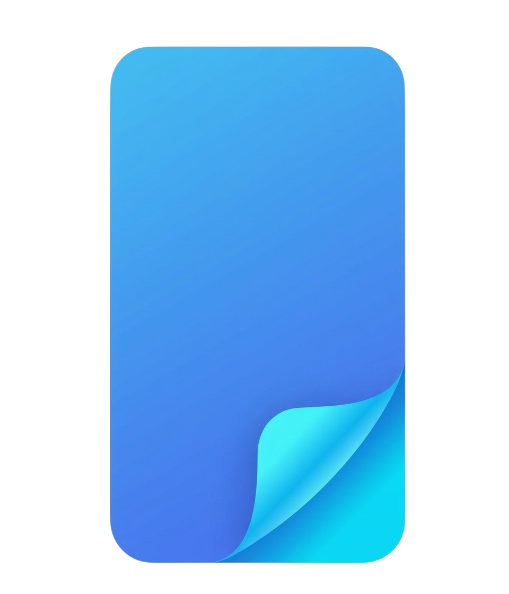
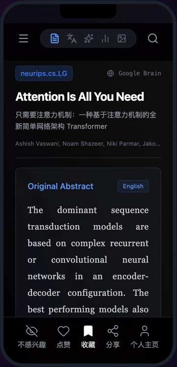

<div align="center">
  
  <h1>FloPap</h1>
  <p><strong>Research Reimagined. The TikTok for Scientific Papers.</strong></p>

  <p>
    <a href="https://flopap.com" target="_blank">
      
    </a>
    <a href="https://github.com/cookiegg/flopap/blob/main/LICENSE">
      
    </a>
    <a href="https://github.com/cookiegg/flopap/releases">
      
    </a>
  </p>

  <p>
    <a href="README_CN.md">🇨🇳 中文文档</a> | 
    <a href="README.md">🇬🇧 English</a>
  </p>
</div>

---

## 🚀 Introduction

**FloPap** redefines how you consume scientific literature. Inspired by the engaging "feed" format of modern social apps (like TikTok), FloPap delivers the latest **ArXiv** and **Conference** (NeurIPS, CVPR, ICLR) papers in a digestible, vertical-scroll format.

Stay consistent with your reading habit, discover seminal works effortlessly, and enjoy a premium, mobile-first experience.

### ✨ Key Features

- **📱 User-Friendly Feed**: Swipe through papers just like short videos.
- **⚡ AI-Powered**: Auto-generated summaries, key insights, and multi-language translation.
- **🎧 Audio Mode**: Listen to papers on the go with high-quality TTS.
- **☁️ Cross-Platform**: Seamless experience on Web, iOS, and Android (PWA/Native).
- **🎨 Premium UI**: Glassmorphism design, smooth animations, and dark mode support.

---

### 📱 Mobile Experience

The interface you see on [flopap.com](https://flopap.com).

<div align="center">
  
</div>

### Core Pipeline

1.  **Global Research Sources**: Aggregates papers from ArXiv (Daily updates) and Top AI Conferences (NeurIPS, CVPR, ICLR).
2.  **AI Content Engine**:
    *   **Summarization**: Generates concise TL;DRs and key takeaways.
    *   **Translation**: Breaks language barriers with accurate multi-language support.
    *   **Audio Synthesis**: Converts text to natural-sounding speech for on-the-go listening.
3.  **Visual Experience**: Presents data in a TikTok-style vertical feed with smart infographics and clear typography.

---

## 📦 Quick Start

### Option A: Docker Compose (Recommended) 🐳

The easiest way to get FloPap running. Requires **Docker** and **Docker Compose**.

1. **Clone the repository**
   ```bash
   git clone https://github.com/cookiegg/flopap.git
   cd flopap
   ```

2. **Configure Environment**
   Create a `.env` file in the root directory and add your API keys:
   ```env
   # Required for AI features
   DEEPSEEK_API_KEY=your_key_here
   DASHSCOPE_API_KEY=your_key_here
   ```

3. **Start the App**
   ```bash
   docker compose up -d
   ```
   *(Note: For older Docker versions, use `docker-compose up -d`)*
   Visit `http://localhost:8000` to start reading!

### Option B: Manual Installation (Development)

Requires Node.js >= 18, Python >= 3.11, PostgreSQL, and Redis.

1. **Frontend Setup**
   ```bash
   cd frontend
   npm install
   npm run dev
   ```

2. **Backend Setup**
   ```bash
   cd backend
   pip install -r requirements.txt
   # Set up your local .env with DATABASE_URL
   python -m app.main
   ```

---

## 🤝 Contributing

We welcome contributions! Please feel free to submit a Pull Request.

1. Fork the Project
2. Create your Feature Branch (`git checkout -b feature/AmazingFeature`)
3. Commit your Changes (`git commit -m 'Add some AmazingFeature'`)
4. Push to the Branch (`git push origin feature/AmazingFeature`)
5. Open a Pull Request

---

## 📄 License

Distributed under the MIT License. See `LICENSE` for more information.

<div align="center">
  <p>Built with ❤️ by <a href="https://github.com/cookiegg">CookieGG</a></p>
</div>
